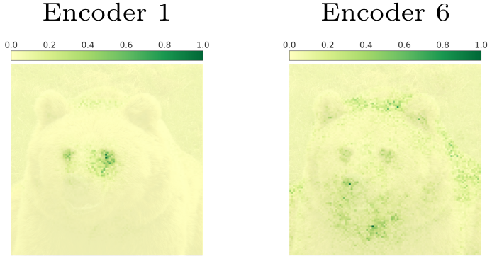
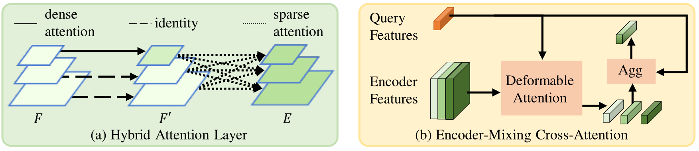
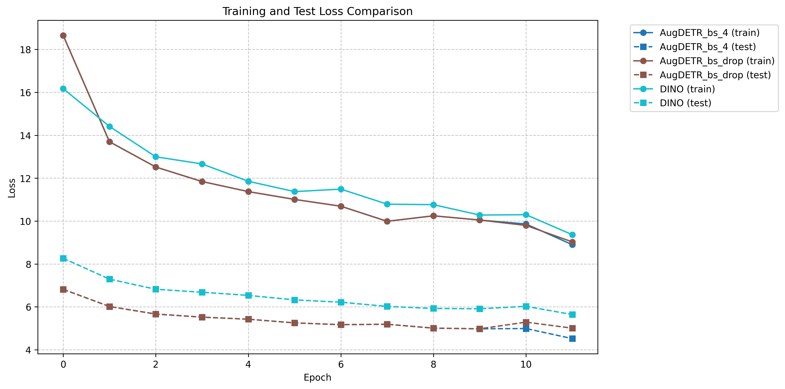
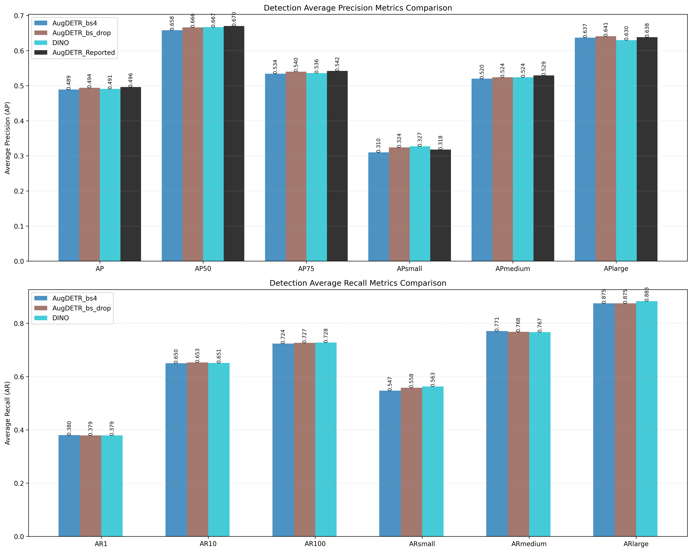
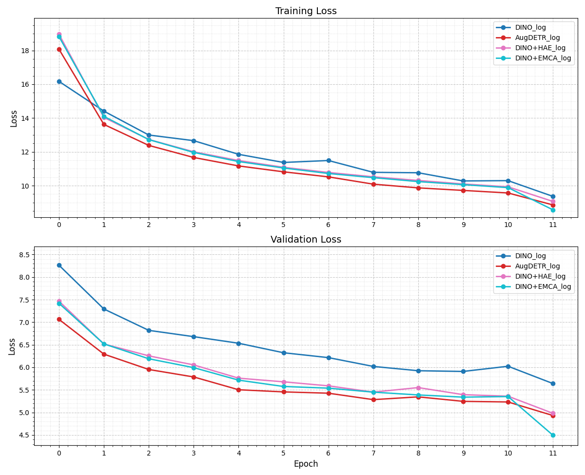
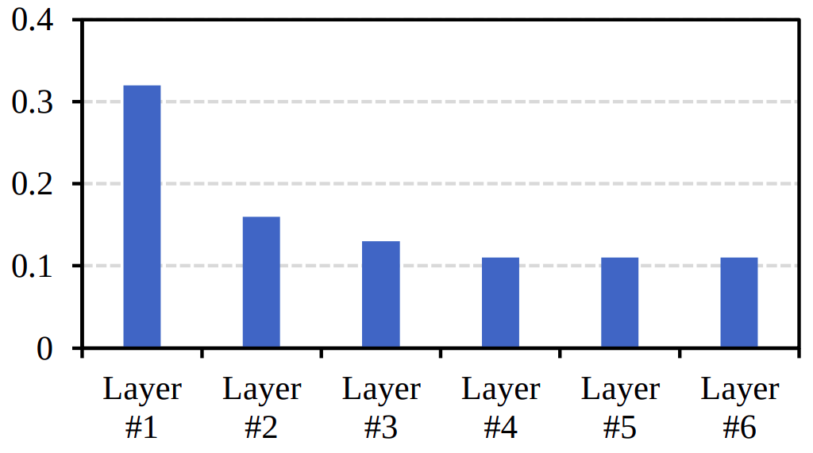
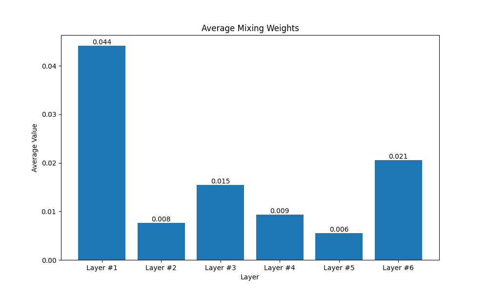

# AugDETR: Improving Multi-scale Learning for Detection Transformer

> **Notice:** This repository is not the official implementation of the paper. While every effort has been made to reproduce the described method, there is no guarantee that the implementation will work exactly as intended or achieve the same results as the original work.

This readme file is an outcome of the [CENG501 (Spring 2024)](https://ceng.metu.edu.tr/~skalkan/DL/) project for reproducing a paper without an implementation. See [CENG501 (Spring 42) Project List](https://github.com/CENG501-Projects/CENG501-Fall2024) for a complete list of all paper reproduction projects.

# 1. Introduction

DEtection TRansformer (DETR) [1] revolutionized object detection by introducing a fully end-to-end approach that eliminated traditional heuristics like anchor generation and non-maximum suppression (NMS). Building upon DETR, Deformable DETR [2] improved performance on small objects (+7 AP) by replacing the self-attention mechanism with Multi-Scale Deformable Attention, which was subsequently adopted by state-of-the-art models like DAB-DETR [3], DN-DETR [4], and DINO [5].

This project focuses on reproducing AugDETR [6] (ECCV 2024), which addresses the limitations of Multi-Scale Deformable Attention through two components:

1. Hybrid Attention Encoder (HAE): Enhances local feature representation
2. Encoder-Mixing Cross-Attention (EMCA): Improves multi-level encoder exploitation

The paper reports the following AP improvements when integrated with existing detectors on the COCO dataset:
- DINO: +1.2 AP
- AlignDETR: +1.1 AP
- DDQ: +1.0 AP

Key experiments to be reproduced:
1. DINO (4-scale) + HAE (12 Epoch): Expected +0.6 AP
2. DINO (4-scale) + HAE + EMCA (12 Epoch): Expected +1.2 AP
3. Quantitative analysis of EMCA weights

Other experiments with longer training schedules and different detectors are skipped due to time constraints. Ablations on the number of hybrid attention layers in HAE (Table 6 in the paper) and Ablations on the layer of input encoders in EMCA (Table 9 in the paper) are also not reported, but they can easily be reproduced using the provided codebase changing the configuration files.


## 1.1. Paper summary

As shown in the table below, while Deformable DETR achieves better overall AP and significantly better AP_S compared to DETR, it performs worse on large objects (AP_L). This observation motivates the paper's analysis of Multi-Scale Deformable Attention's limitations.

<div align="center">
<table>
<caption><b>Table 1:</b> Performance comparison between DETR and Deformable DETR.</caption>
<tr>
    <th>Method</th>
    <th>Epochs</th>
    <th>AP</th>
    <th>AP_S</th>
    <th>AP_M</th>
    <th>AP_L</th>
</tr>
<tr>
    <td>DETR [1]</td>
    <td>500</td>
    <td>42.0</td>
    <td>20.5</td>
    <td>45.8</td>
    <td>61.1</td>
</tr>
<tr>
    <td>Deformable DETR [2]</td>
    <td>50</td>
    <td>44.5</td>
    <td>27.1</td>
    <td>47.6</td>
    <td>59.6</td>
</tr>
</table>
</div>

This paper studies the limitations of Multi-Scale Deformable Attention in two aspects:

#### Local Feature Enhancement: 
The paper identifies that Deformable DETR's sparse attention mechanism, while computationally efficient, has limitations in its receptive field. By using a fixed number of deformable sampling points, it struggles to achieve the larger receptive fields needed for detecting large objects. Furthermore, sparse attention loses global context information that could be valuable in complex scenes.

####  Multi-level Encoder Exploitation: 
Current DETR-based detectors typically use six encoder layers but only utilize features from the last encoder layer in the decoder. The paper analyzes the receptive fields of different encoder layers and reveals their distinct characteristics (Fig. 1). For instance, Encoder 1 shows a more concentrated, localized attention pattern, while Encoder 6 exhibits a broader, more diffused receptive field. This observation suggests that different encoder layers capture complementary features at varying scales. However, existing methods only use the last encoder layer, potentially missing valuable information from earlier layers. The paper argues that adaptively using multi-level encoder features based on query features would better facilitate multi-scale learning, as objects at different scales may benefit from different combinations of these receptive fields.

<div align="center">

<p><b>Fig. 1:</b> Comparison of receptive fields of different encoders. Encoder 1 shows a concentrated pattern while Encoder 6 exhibits a broader receptive field.</p>
</div>

These insights led to the development of two components:

- Hybrid Attention Encoder (HAE): Combines dense and sparse attention to enhance local features
- Encoder-Mixing Cross-Attention (EMCA): Enables adaptive use of multi-level encoder features


# 2. The method and our interpretation

## 2.1. The original method

The paper introduces two main components that build upon the Deformable DETR architecture, as illustrated in Fig. 2.

<div align="center">

<p><b>Fig. 2:</b> (a) is the process of hybrid attention in the Hybrid Attention Layer. Dense attention is first applied to only the top features, and then sparse attention is applied to the multi-scale features. (b) is the details of Encoder-Mixing Cross-Attention. Deformable attention extracts multiple object features from multi-level encoder and then the extracted features are aggregated based on the adaptive fusion weights learned from the query features.</p>
</div>


### 2.1.1. Hybrid Attention Encoder (HAE)

In original DETR, self-attention (dense attention) is formulated as:

<div align="center">

$\mathbf{Q} = W_q P_5, \mathbf{K} = W_k P_5, \mathbf{V} = W_v P_5$

$\text{SelfAttention}(\mathbf{Q}, \mathbf{K}, \mathbf{V}) = \text{Softmax}(\mathbf{Q}\mathbf{K})\mathbf{V}$

</div>

where:
- $P_5$ represents the features from the last encoder layer.
- $Q$, $K$, and $V$ are query, key, and value features, respectively.


Deformable DETR replaced this with multi-scale deformable attention (sparse attention):

<div align="center">

$\mathbf{Q} = \text{Concat}(P_3, P_4, P_5), \mathbf{A} = W_a \mathbf{Q}$

$\Delta r = W_p \mathbf{Q}, \mathbf{V} = \text{Samp}(W_v\mathbf{Q}, r + \Delta r)$

$\text{DeformableAttention}(\mathbf{Q}, \mathbf{V}) = \text{Softmax}(\mathbf{A})\mathbf{V}$

</div>

where:
- $P_3, P_4, P_5$ are multi-scale features from last 3 encoder layers
- $r$ represents the reference points
- $\Delta r$ represents learnable offsets from reference points
- $\text{Samp}$ is the bilinear sampling function
- $W_a, W_p, W_v$ are learnable parameters

The proposed HAE combines standard self-attention with deformable attention in the encoder layer (Fig. 2(a)). To maintain computational efficiency, HAE employs a hybrid-scale strategy where dense attention is applied only to the last scale features $(P_5)$, while deformable attention operates on all scales.

<div align="center">

$\mathbf{Q'} = \mathbf{K'} = \mathbf{V'} = P_5$

$P_5' = \text{SelfAttention}(\mathbf{Q'}, \mathbf{K'}, \mathbf{V'})$

$\mathbf{Q} = \text{Concat}(P_3, P_4, P_5'), \mathbf{A} = W_a \mathbf{Q}$

$\Delta r = W_p \mathbf{Q}, \mathbf{V} = \text{Samp}(W_v\mathbf{Q}, r + \Delta r)$

$\text{DeformableAttention}(\mathbf{Q}, \mathbf{V}) = \text{Softmax}(\mathbf{A})\mathbf{V}$

</div>

### 2.1.2. Encoder-Mixing Cross-Attention (EMCA)

In Deformable DETR, the cross-attention in the decoder uses multi-scale deformable attention to achieve query-feature interaction with only the last encoder layer:

<div align="center">

$\mathbf{A} = W_a \mathbf{Q}, \Delta r = W_p \mathbf{Q}, \mathbf{V} = \text{Samp}(W_vE_6, r + \Delta r)$

$\text{DeformableAttention}(\mathbf{Q}, \mathbf{V}) = \text{Softmax}(\mathbf{A})\mathbf{V}$

</div>

where $E_6$ represents features from only the last encoder layer.

EMCA extends this by enabling interaction with all encoder layers (Fig. 2(b)). For each encoder layer $l$, it computes:

<div align="center">

$\mathbf{A} = W_a \mathbf{Q}, \Delta r = W_p \mathbf{Q}, \mathbf{w}_e = \sigma(W_e \mathbf{Q})$

$\mathbf{V}_l = \text{Samp}(W_{vl}E_l, r + \Delta r)$

$\text{EMCA}(\mathbf{Q}, \mathbf{E}) = \sum_{l=1}^{L} w_e^l \cdot \text{Softmax}(\mathbf{A})\mathbf{V}_l$

</div>

where:
- $\sigma$ is the Sigmoid activation
- $E_l$ represents the features from encoder layer $l$
- $w_e^l$ is the learned weight for encoder layer $l$
- $L$ is the total number of encoder layers
- $W_e$ is a learnable projection matrix for generating fusion weights

The key innovation of EMCA is its ability to adaptively weight features from different encoder layers based on query characteristics. This allows objects of different scales to leverage the most appropriate combination of encoder features, as earlier layers tend to capture more local details while later layers capture more global context.

## 2.2. Our interpretation

Using DINO_4scale configuration, we obtain a three-levels of features from the ResNet-50 backbone, then the fourth level is obtained by downsampling the third level. I assumed that these 4 levels correspond to the P2, P3, P4, and P5. 

In the paper the batch size is said to be 16. I asked the authors about the batch size and they said that they set the batch size to 8 per card and used 2 cards. My previous experiments with DINO showed that the batch size of 2 per card (as in the original DINO code) reproduces the results (with only small variations) independent from the number of cards. Therefore, I decided to set batch size to 2 as in the [original DINO code](https://github.com/IDEA-Research/DINO/blame/d84a491d41898b3befd8294d1cf2614661fc0953/config/DINO/DINO_4scale.py#L12). I performed an experiment using batch size 4 on a single A6000 GPU, the results were worse than the baseline.

# 3. Experiments and results

### Trained Checkpoints and Logs: [Google Drive](https://drive.google.com/drive/folders/12nbbSn_1UuJDJvZICWBUuo_6abNauSfN?usp=sharing)

## 3.1. Experimental setup

### Original Paper Setup

The authors conducted experiments on the COCO 2017 detection dataset using the following configuration:

- **Dataset**: COCO 2017 (train: 118K images, val: 5K images)
- **Backbone**: ResNet-50-4scale
- **Training Schedule**: 12 epochs and 24 epochs 
- **Batch Size**: 16 (8 per card, 2 cards)
- **Optimizer**: AdamW with weight decay 1e-4
- **Learning Rate**: Initial 1e-4, decreased by 0.1 at epoch 11

### Our Modified Setup

We kept everything as described in the paper except batch-size. All details that are not mentioned in the paper are inherited from default parameters of the baseline model (DINO). We kept the batch-size as 2 as in the original DINO code.

## 3.2. Running the code

### Installation

1. install pytorch and torchvision with cuda support. You can follow the instructions on the [official website](https://pytorch.org/get-started/locally/).
```bash
pip install torch torchvision
```

2. Install the required packages.
```bash
pip install -r requirements.txt
```
3. Compile the deformable attention module.
```bash
cd models/dino/ops
python setup.py build install
cd ../../..
```

### Training

#### DINO + HAE

```bash
python main.py \
	--output_dir logs/DINO/R50-MS4 -c config/DINO/DINO_4scale.py \
    --coco_path {/path/to/coco} \
	--options dn_scalar=100 embed_init_tgt=TRUE \
	dn_label_coef=1.0 dn_bbox_coef=1.0 use_ema=False \
	dn_box_noise_scale=1.0 --use_hae
```

#### DINO + EMCA

```bash
python main.py \
	--output_dir logs/DINO/R50-MS4 -c config/DINO/DINO_4scale.py \
    --coco_path {/path/to/coco} \
	--options dn_scalar=100 embed_init_tgt=TRUE \
	dn_label_coef=1.0 dn_bbox_coef=1.0 use_ema=False \
	dn_box_noise_scale=1.0 --use_emca
```

#### AugDETR (DINO + HAE + EMCA)

```bash
python main.py \
    --output_dir logs/DINO/R50-MS4 -c config/DINO/DINO_4scale.py \
    --coco_path {/path/to/coco} \
    --options dn_scalar=100 embed_init_tgt=TRUE \
    dn_label_coef=1.0 dn_bbox_coef=1.0 use_ema=False \
    dn_box_noise_scale=1.0 --use_hae --use_emca
```

You can also control the number of hybrid attention layers using the `--num_hae_layers` argument. The default value is 2.


### Evaluation

#### DINO + HAE

```bash
python main.py \
  --output_dir logs/DINO/R50-MS4-%j \
        -c config/DINO/DINO_4scale.py --coco_path {/path/to/coco} \
        --eval --resume {/path/to/checkpoint} \
        --options dn_scalar=100 embed_init_tgt=TRUE \
        dn_label_coef=1.0 dn_bbox_coef=1.0 use_ema=False \
        dn_box_noise_scale=1.0 --use_hae
```

#### DINO + EMCA

```bash
python main.py \
  --output_dir logs/DINO/R50-MS4-%j \
        -c config/DINO/DINO_4scale.py --coco_path {/path/to/coco} \
        --eval --resume {/path/to/checkpoint} \
        --options dn_scalar=100 embed_init_tgt=TRUE \
        dn_label_coef=1.0 dn_bbox_coef=1.0 use_ema=False \
        dn_box_noise_scale=1.0 --use_emca
```

#### AugDETR (DINO + HAE + EMCA)

```bash
python main.py \
  --output_dir logs/DINO/R50-MS4-%j \
        -c config/DINO/DINO_4scale.py --coco_path {/path/to/coco} \
        --eval --resume {/path/to/checkpoint} \
        --options dn_scalar=100 embed_init_tgt=TRUE \
        dn_label_coef=1.0 dn_bbox_coef=1.0 use_ema=False \
        dn_box_noise_scale=1.0 --use_hae --use_emca
```


## 3.3. Results

### Experiment 1: Ablations on each component of AugDETR. "HAE" and "EMCA" (Table 4 in the paper)

The paper introduces two components, HAE and EMCA, and evaluates their impact on the AP results. The results are summarized in the table below.

<!-- | Model              | AP   | AP_50 | AP_75 | AP_S | AP_M | AP_L |
|-------------------|------|-------|-------|------|------|------|
| DINO (bs=2) (reported)    | 49.0 | 66.6  | 53.5  | 32.0 | 52.3 | 63.0 |
| DINO + HAE (reported)     | 49.6 (+0.6) | 67.0 (+0.4) | 54.2 (+0.7) | 31.8 (-0.2) | 52.9 (+0.6) | 63.8 (+0.8) |
| DINO + HAE (bs=4)         | 48.9 (-0.1) | 65.8 (-0.8) | 53.4 (-0.1) | 31.0 (-1.0) | 52.0 (-0.3) | 63.7 (+0.7) |
| DINO + HAE (bs=drop 4->2) | 49.4 (+0.4) | 66.6 (+0.0) | 54.0 (+0.5) | 32.4 (+0.4) | 52.4 (+0.1) | 64.1 (+1.1) |

<div align="center">

<p><b>Figure 1:</b> Training and validation loss curves for DINO baseline and our HAE implementations with different batch size settings.</p>
</div>

<div align="center">

<p><b>Figure 2:</b> Detection metrics comparison across different object scales. The metrics include Average Precision (AP) and Average Recall (AR) at various scales and thresholds.</p>
</div> -->

| Model Configuration |     | Original Results |  |  |  |  |  | Our Reproduction |  |  |  |  |  |
|:-------------------|:----|:----------------:|--:|--:|--:|--:|--:|:--------------:|--:|--:|--:|--:|--:|
| HAE | EMCA | AP | AP₅₀ | AP₇₅ | APₛ | APₘ | APₗ | AP | AP₅₀ | AP₇₅ | APₛ | APₘ | APₗ |
| | | 49.0 | 66.6 | 53.5 | 32.0 | 52.3 | 63.0 | 49.0 | 66.6 | 53.5 | 32.0 | 52.3 | 63.0 |
| ✓ | | 49.6 | 67.0 | 54.2 | 31.8 | 52.9 | 63.8 | 49.7 | 67.2 | 54.2 | 31.4 | 53.0 | 64.3 |
| | ✓ | 49.8 | 67.4 | 54.6 | 33.0 | 52.8 | 64.7 | 49.7 | 67.4 | 54.5 | 32.1 | 53.2 | 64.4 |
| ✓ | ✓ | 50.2 | 67.8 | 55.0 | 32.3 | 53.2 | 64.7 | 49.9 | 67.6 | 54.5 | 32.3 | 52.8 | 65.4 |

HAE implementation seems to be reproducing the results as expected. There is only slight differences in the AP values. Furthermore, our implementation even outperforms the original results in AP_L, which is the main concern of the paper.

EMCA implementation also produces similar results to the original paper. However, the AP_L value is lower than the original results.

Overall implementation of AugDETR (DINO + HAE + EMCA) increase the AP by 0.9 points compared to the baseline DINO model while the original paper reports 1.2 points increase. The increase in AP_L is suprisingly higher (2.4 points) than the original paper (1.7 points). 

Train and validation loss curves for all the ablation experiments are shown in Fig. 3. There is no surprising behavior in the loss curves, except from the abrupt decrease in the last epoch of DINO+EMCA. There, training process is killed with an error, and I had to switch to another GPU, reducing number of GPUs from 4 to 1. This might affect the results. I could not retry the experiment due to time constraints.

<div align="center">

<p><b>Figure 3:</b> Training and validation loss curves for DINO baseline and our HAE implementations with different batch size settings.</p>
</div>

### Experiment 2: Quantitative analysis of EMCA weights (Fig. 4 in the paper)

In the paper the authors analyze the fusion weights (denoted as $W_e$) in the EMCA layers. This weights simply show how much each encoder layer contributes to the final feature representation. Since there are 6 encoder layers, the output of this linear layer should be a 6-dimensional vector. The authors saved these vectors from the last EMCA layer during evaluation on COCO and plotted the average values for each encoder layer, as shown in Fig. 4 in the paper.

<div align="center">

<p><b>Fig. 4:</b> Reported average EMCA weights for each encoder layer in the original paper.</p>
</div>

They did not provide the exact values of these weights, so I could not compare the results. However, we can comment on the general behavior of the weights. Fig. 5 shows the average EMCA weights for each encoder layer in our reproduction. 

<div align="center">

<p><b>Fig. 5:</b> Average EMCA weights for each encoder layer in our reproduction.</p>
</div>

As mentioned in the paper, the weights show a decreasing trend and an increase in the last encoder layer. This indicates that we are on the right track in terms of the EMCA weights. However, the weights for Layer #2 is significantly lower than the original results, and the weights for Layer #6 is significantly higher. For this reason, we can conclude that the EMCA implementation is not exactly the same as the original paper although the general trend and effect of the weights are similar.


<!-- #### Discussion

The loss curves were promising. Both the training and validation losses decreased consistently, with no signs of overfitting. Moreover, it seems both settings converged faster than the baseline DINO model. However, the AP results did not align with the expected +0.6 AP improvement. The setting with batch-size 4 had the least loss on the validation set, but the AP results were even lower than the baseline. Consistent incerease in AP_large indicates we are on the right track since the performance on large objects is the main concern of the paper. We guess that the problem might be related to the batch-size reduction, which could have affected the model's learning dynamics. We will investigate this further in the next experiments.  -->


# 4. Conclusion

In general, the results of the experiments are consistent with the original paper. HAE and EMCA components seem to be reproduced when they are examined separately. However, the overall improvement in AP is slightly lower than the original paper. Quantitative analysis of EMCA weights also shows a similar trend, but the exact values are not the same. From these results, we can suspect that the implementation of EMCA is not exactly the same as the original paper, and this might be the reason for the lower AP improvement. 

The ablations on the number of hybrid attention layers in HAE and the layer of input encoders in EMCA are not reported. These experiments can be easily reproduced using the provided codebase by changing the configuration files. num_hae_layers argument directly controls the number of hybrid attention layers. For the layer of input encoders in EMCA, you need the change constructor of the DeformableTransformerDecoder class. The implementation of a HAE and EMCA layers can be found starting from [line 1165 in models/dino/deforamble_transformer.py file](https://github.com/CENG501-Projects/CENG501-Fall2024/blob/bdd2709157894c6f16fb4a6e24e3b4e04db9f65f/Bayar/models/dino/deformable_transformer.py#L1165).

# 5. References

[1] N. Carion, F. Massa, G. Synnaeve, N. Usunier, A. Kirillov, and S. Zagoruyko, "End-to-end object detection with transformers," in European conference on computer vision, 2020, pp. 213–229.

[2] X. Zhu, W. Su, L. Lu, B. Li, X. Wang, and J. Dai, "Deformable DETR: Deformable transformers for end-to-end object detection," arXiv preprint arXiv:2010.04159, 2020.

[3] S. Liu, F. Li, H. Zhang, X. Yang, X. Qi, H. Su, J. Zhu, and L. Zhang, "DAB-DETR: Dynamic anchor boxes are better queries for DETR," in International Conference on Learning Representations, 2021.

[4] F. Li, H. Zhang, S. Liu, J. Guo, L. M. Ni, and L. Zhang, "DN-DETR: Accelerate DETR training by introducing query denoising," in Proceedings of the IEEE/CVF Conference on Computer Vision and Pattern Recognition, 2022, pp. 13619–13627.

[5] H. Zhang, F. Li, S. Liu, L. Zhang, H. Su, J. Zhu, L. M. Ni, and H.-Y. Shum, "DINO: DETR with improved denoising anchor boxes for end-to-end object detection," in The Eleventh International Conference on Learning Representations, 2022.

[6] J. Dong, Y. Lin, C. Li, S. Zhou, and N. Zheng, "AugDETR: Improving multi-scale learning for detection transformer," in ECCV 2024, 2024.

# Contact

Emirhan Bayar 
bayaremirhan07@gmail.com
